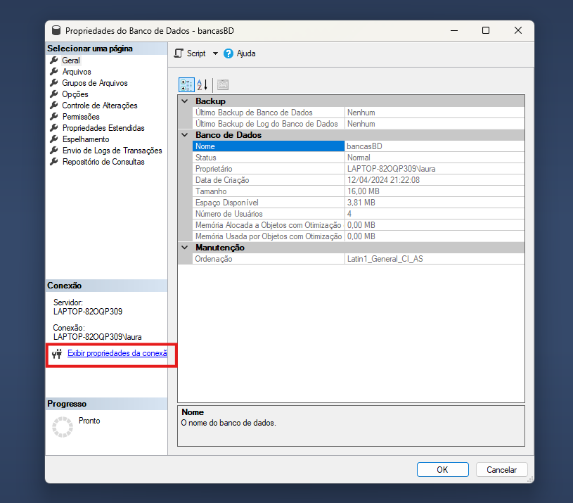

# Sistema Bancas de TCC

## Descrição

Sistema de formação de bancas de TCC dos cursos da Unisinos

## Começando

### Instalação Front

1. Entrar na pasta do front (`SistemaBancas/front/sistemaBancas`)
2. Instalar o npm: `npm install vue`

### Instalação Back

Para o projeto do back é necessário fazer a instalação da SDK do .NET:

https://dotnet.microsoft.com/pt-br/download

1. Entrar na pasta do back (`SistemaBancas/back/sistemaBancas`)
2. Adicionar o pacote do Sql Server: `dotnet add package Microsoft.EntityFrameworkCore.SqlServer`
3. Adicionar o pacote do Design: `dotnet add package Microsoft.EntityFrameworkCore.Design`
4. Instalar o SDK do Entity Framework Core: `dotnet tool install --global dotnet-ef`

### Inicialização Front

1. Entrar na pasta do front (`SistemaBancas/front/sistemaBancas`)
2. Digitar o comando de inicialização: `npm run dev`

### Inicialização Back

1. Entrar na pasta do front (`SistemaBancas/back/sistemaBancas`)
2. Digitar o comando de build: `dotnet build` (opicional)
3. Digitar o comando de inicialização: `dotnet run`

### Configuração Banco de Dados

1. Instalar o Sql Server Developer: https://www.microsoft.com/pt-br/sql-server/sql-server-downloads
    Tutorial Youtube: https://youtu.be/Lc3yclqM8rQ?si=tr5UWsbDcMQUUHYm
2. Instalar o Sql Management: https://learn.microsoft.com/pt-br/sql/ssms/download-sql-server-management-studio-ssms?view=sql-server-ver16
3. Criar o banco da aplicação: 

#### String de Conexão

-> Fica no arquivo appsettings.json
-> Para configurar a string de conexão basta modificar as informações conforme as propriedades de conexão do banco

### Mudanças do Banco de Dados pelo Context

Toda vez que é realizada alguma alteração de código que impactará a estrutura do banco de dados, será necessário realizar os seguintes passos:

1. Excluir o banco de dados do SQL Management
2. Criar um novo banco (o nome deve ser o mesmo que o que está definido na string de conexão)
3. Excluir a pasta de Migrations
4. Criar uma nova migration: `dotnet ef migrations add nome_migration`
5. Atualizar o banco: `dotnet ef database update`

## Postman

-> A utilização do Postman será de grande auxílio para verificar as chamadas do métodos da api
-> Link de instalação: https://www.postman.com/downloads/
-> Já há três endpoints de exemplo no código inicial:

http://localhost:8000/api/professor/getProfessores

http://localhost:8000/api/professor/getProfessor/{id}

http://localhost:8000/api/professor/addProfessor

